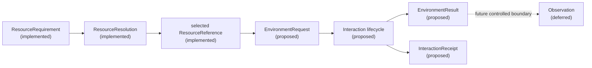
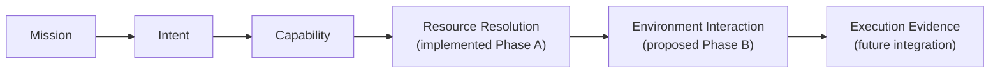
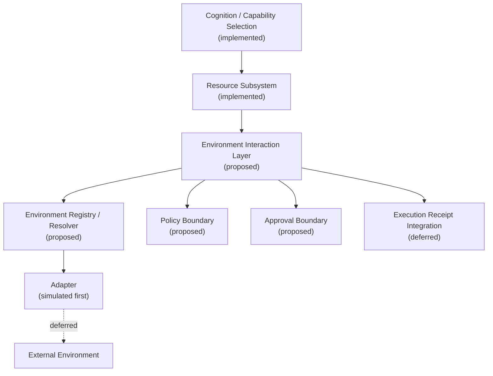
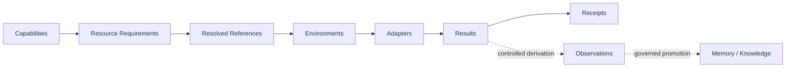

# v0.5 Phase B — Environment Interaction Layer

> **Status: Proposed architecture.** This document is the current architecture
> authority for Phase B. It designs a simulation-first boundary; it does not
> describe implemented environment runtime behavior. The earlier
> [environment interface](environment-interface.md) and
> [ADR-004](../adr/ADR-004-environment-interface.md) are preserved as historical
> precursors. [ADR-006](../adr/ADR-006-environment-interaction-layer.md) records
> this refined decision.

## 1. Purpose

The Environment Interaction Layer converts a resolved operational resource
into a safe, explicit, auditable, provider-neutral interaction. It exists
because a resource reference identifies *what* AEGIS intends to act on, but
does not authorize or implement that action.

Direct SDK, filesystem, HTTP, vendor API, or tool invocation from cognition is
insufficient: it couples reasoning to providers, hides side effects, conflates
availability with authorization, and prevents consistent evidence. AEGIS
instead reasons in semantic operations against resolved resources. Provider
details stay behind adapters.

The layer extends the implemented Operational Resource Foundation by consuming
its selected `ResourceReference` values. It does not replace resource
resolution or silently repeat it.

## 2. Scope

### Implemented today

- Phase A resource contracts, explicit in-memory catalog, deterministic
  resolver, relations, evidence, and validation;
- current simulated `ExecutionRequest`, `ExecutionStep`, and
  `ExecutionReceipt` contracts;
- current cognitive pipeline, capability selection, governed execution
  checks, and deterministic benchmark mechanisms.

### Designed for Phase B

- immutable environment request and normalized result contracts;
- explicit environment and adapter definitions;
- deterministic environment registry and resolver;
- policy and approval interfaces;
- simulation-only adapter invocation;
- immutable, bounded interaction receipts.

### Deferred

Real filesystem, GitHub, Gmail, calendar, database, browser, shell, network,
credential, dynamic-discovery, persistent-approval, production-adapter,
autonomous-execution, memory, and reflection integrations are deferred. None
is implemented or authorized by this architecture.

## 3. Architectural responsibilities

The layer owns request validation, declared-support checks, deterministic
environment selection, policy and approval routing, compatible adapter
invocation, result normalization, interaction evidence, receipts, and
deterministic simulation.

It does not own mission interpretation, capability selection, resource
discovery or resolution semantics, arbitrary planning, business logic, memory
promotion, knowledge inference, provider-specific reasoning, secret
management, persistent approval storage, or long-running orchestration.

## 4. Terminology

- **Interaction:** one governed attempt to apply one semantic operation to
  resolved resource references through one selected environment.
- **Operation:** provider-neutral action semantics, not a method name.
- **Environment:** a registered operational and trust context through which
  resources can be accessed.
- **Adapter:** provider-specific implementation behind normalized contracts.
- **Environment capability:** declaration that an environment supports an
  operation for specified resource types and modes.
- **EnvironmentRequest:** immutable proposal for an interaction.
- **EnvironmentResult:** normalized operational outcome.
- **InteractionReceipt:** immutable audit evidence for the complete boundary
  lifecycle.
- **PolicyDecision:** rule-derived permission outcome.
- **ApprovalRequirement:** consent obligation produced or recognized by policy.
- **Observation:** later, controlled information derived from a result.
- **ResourceReference:** lightweight Phase A identity/version selector for a
  resolved resource.
- **ExecutionReceipt:** current workflow-level execution evidence.

A resource is the semantic target; an environment is an access and trust
context. A capability says what AEGIS can conceptually perform; an operation
says what interaction is requested. An operation is stable semantics; an
adapter method is an implementation detail. A result is operational output; a
receipt proves what happened. An observation is interpreted information, not
raw output. Policy determines permission; approval proves required consent.
An execution receipt covers a workflow attempt; an interaction receipt covers
one governed environment crossing.

## 5. Universal operation model

The minimum Phase B vocabulary should be:

| Operation | Semantics | Side effect | Idempotency and permission |
|---|---|---|---|
| `READ` | Retrieve a known target's bounded representation | none intended | repeatable; requires read |
| `LIST` | Enumerate bounded members of a known target/context | none intended | repeatable; requires inspect/read |
| `SEARCH` | Query bounded targets using structured criteria | none intended | repeatable for fixed simulation state; requires discover/read |
| `CREATE` | Create a new resource or child | state-changing | requires explicit create and an idempotency key |
| `UPDATE` | Change an existing target | state-changing | conflict/version controls and modify permission |
| `DELETE` | Remove or mark a target deleted | destructive | explicit delete permission and replay protection |
| `EXECUTE` | Invoke target-defined computation or behavior | potentially high | explicit execute permission and bounded execution |

`OBSERVE` is not an adapter operation: observation generation is a later
interpretation boundary. `NOTIFY` is initially expressible as `CREATE` against
a message resource; it can become distinct if delivery semantics justify it.

The initial runtime may simulate all seven operations, but should enable
`READ`, `LIST`, and `SEARCH` first and require deterministic policy fixtures
for mutating or executing simulations. No operation implies live access.
Inputs and outputs are structured, schema-bounded values. Provider actions
such as an HTTP verb or SDK method remain adapter details.

## 6. Environment definition

An environment is a provider-neutral operational context, such as a repository,
document, communication, knowledge, compute, or simulated-test environment.
It has stable identity and type; supported operations and resource types;
declared capabilities; trust, execution-mode, and side-effect profiles; a
policy-profile reference; an adapter reference; lifecycle state; and schema
version.

These are conceptual properties, not finalized Python field names. An
environment is not a resource descriptor, credential container, provider
client, or authorization grant.

## 7. EnvironmentRequest

The canonical request concept contains request and correlation identities;
one or more selected `ResourceReference` values; semantic operation; bounded
structured arguments; environment constraints; required permissions; explicit
side-effect intent; simulation mode; idempotency key where relevant; timeout
or execution constraints; actor/requester context; evidence requirements; and
schema version.

Invariants:

- targets are references selected by a successful `ResourceResolution`, unless
  a later specification explicitly defines a creation target context;
- arguments are structured, bounded, serializable, and secret-free;
- operation and resource type are compatible;
- side effects are explicit and consistent with the operation;
- simulation can never silently become live execution;
- mutation/replay-sensitive requests carry an idempotency key;
- request and correlation identities are stable and traceable.

Policy rules, grants, adapter configuration, credentials, provider clients, and
raw provider locators do not belong in the request.

## 8. EnvironmentResult

The normalized result distinguishes `success`, `denied`,
`approval_required`, `unsupported`, `unavailable`, `invalid_request`,
`timeout`, `conflict`, `adapter_failure`, `partial`, and `simulated`.
Whether `simulated` is a status or an orthogonal flag is left to the
specification; it must never be ambiguous.

It conceptually carries result and request identities, status, bounded
normalized output, returned resource references, safe metadata, classified
error details, evidence summary, adapter attribution, simulation flag,
duration/timestamp policy, and schema version.

Simulation must make status, output, reason codes, evidence order, and
attribution deterministic for fixed inputs. Live timing, provider correlation,
remote state, and returned content may vary later and must be captured as
observed facts rather than inputs to hidden ranking.

## 9. InteractionReceipt

A result answers what the operation returned. A receipt proves how the governed
interaction was handled. The receipt records the request summary and target;
selected environment and adapter; policy decision; approval requirement and
decision; simulation state; result classification; bounded evidence; and links
to its request, resource resolution, workflow step, and execution receipt.

Receipts are immutable after terminal construction so audit evidence cannot be
rewritten by adapters or later cognition. They exclude credentials, tokens,
secret values, raw exceptions, and unbounded provider payloads. Evidence uses
safe summaries, stable reason codes, hashes or opaque references where useful,
fixed size/count limits, and deterministic ordering.

## 10. EnvironmentAdapter

An adapter declares identity/version and support; validates provider-specific
feasibility; translates semantic operations; executes or simulates; normalizes
provider responses and failures; and returns structured contract values.
Conceptual lifecycle surfaces are declaration, compatibility/availability
assessment, invocation or simulation, and optional bounded cancellation.

An adapter must not reinterpret intent, select resources, bypass policy,
approve itself, retrieve undeclared secrets, broaden permissions, alter
governance decisions, or leak arbitrary provider objects. The implementation
specification will define the Python protocol.

## 11. Environment registry and resolution

Registration is explicit at a composition root. There is no import-time
discovery, hidden global registry, or automatic plugin loading. Duplicate
environment or adapter identities are rejected.

Resolution filters registered, active definitions by resource type, operation,
execution mode, side-effect support, policy constraints, and any explicit
environment constraint. It then applies declared preferences and a stable
identity ordering. Equal best candidates for a single selection are
`ambiguous`; it must not silently choose the first. No match distinguishes
unsupported operation, unavailable environment, and incompatible environment.
Registration order never changes the result. Adaptive ranking is excluded.

## 12. Policy boundary

Policy evaluates actor, resource, operation, candidate environment, requested
permissions, side-effect level, simulation/live mode, ownership, trust,
constraints, and governance profile. Outcomes are `allow`, `deny`,
`require_approval`, `simulation_only`, and `unsupported`.

Phase B may initially implement an interface and deterministic default-deny or
simulation-only evaluator, not a complete policy engine. A resource descriptor
advertising a permission means the target may support it; that is descriptive
input, not authorization.

## 13. Approval boundary

Policy asks, “Is this permitted under rules?” Approval asks, “Has the required
human or authority consent been obtained?” Approval cannot override denial or
broaden scope.

An approval record conceptually binds an identity, approver, state, exact
request/scope, policy version, issue/expiry, and one-time or reusable semantics.
Missing or expired required approval returns `approval_required` or
`approval_expired` without invocation. Simulation follows policy: it may waive
human approval only when an explicit simulation policy says so. Storage and a
full approval database are deferred.

## 14. Lifecycle

Environment resolution occurs before final policy evaluation because policy
must evaluate the concrete environment's trust and side-effect profile.
Validation and compatibility filtering occur first; candidate enumeration
must be side-effect free and reveals no protected provider data. Policy then
evaluates the selected candidate, followed by approval.

1. Construct request.
2. Validate contract.
3. Validate resolved references and reject stale/incompatible selectors.
4. Check operation/resource compatibility.
5. Resolve an environment and adapter deterministically.
6. Evaluate policy for that concrete candidate.
7. Evaluate required approval.
8. Invoke or simulate the adapter.
9. Validate and normalize the result.
10. Construct the immutable receipt.
11. Hand receipt summary/reference to execution evidence.
12. Later, generate controlled observations.

## 15. Failure taxonomy

Expected domain outcomes are `invalid_request`, `unresolved_reference`,
`stale_reference`, `incompatible_reference`, `unsupported_operation`,
`no_compatible_environment`, `ambiguous_environment`, `denied`,
`approval_required`, `approval_expired`, `unavailable`, `timeout`, `conflict`,
`partial_completion`, and `simulation_mismatch`.

Adapter/provider failures are `adapter_failure` and
`malformed_adapter_result`; safe subcodes may distinguish retryability without
authorizing a retry. Programmer/configuration errors include duplicate
registration, invalid declaration, and `internal_invariant_violation`; these
should fail loudly rather than masquerade as ordinary denial.

## 16. Determinism

The same registry, reference, request, policy input, approval state, and adapter
simulation configuration must produce the same selected environment/adapter,
policy and approval outcomes, result status/output/reason, evidence ordering,
and receipt structure. IDs and clocks needed for equality are supplied inputs
or deterministic fixtures, not generated implicitly.

Future live duration, timestamps, provider IDs, concurrent state, and content
may vary. Receipts must label those values, preserve their source, and keep
them out of deterministic selection unless explicitly declared before
resolution.

## 17. Security model

The layer is default-deny, least-privilege, simulation-first, and explicit
about side effects. Requests have bounded arguments and no embedded secrets.
Outputs are schema-validated, size-limited, redacted, and marked untrusted when
provider or resource content can influence cognition. Adapters isolate provider
objects and exceptions. Policy and approval are separate from invocation.
Receipts are immutable and minimized.

Ownership and environment trust are inputs, never implicit grants.
Idempotency and replay controls protect mutations. A simulation request can
only select a simulation-capable adapter and cannot escalate to live mode.
Prompt injection in returned content is data, not instruction. No adapter may
gain permissions, operations, network access, or credentials absent explicit
declaration and authorization.

## 18. Resource subsystem integration

`ResourceRequirement` and `ResourceResolution` remain resource-subsystem
contracts. Phase B consumes selected `ResourceReference` values and never
silently re-resolves them. It may validate reference freshness and inspect
registered type/capability declarations for compatibility.

Results may return new or updated references, but catalog mutation is a
separate explicit later action. `ResourceRelation` remains descriptive and
`Observation` remains separate. Resource permissions inform policy but do not
authorize interaction. Resolution evidence proves target selection;
interaction evidence proves boundary handling.

## 19. Capability subsystem integration

Capabilities describe what AEGIS can conceptually perform. Operations describe
individual semantic interactions. Environments declare operation support and
adapters implement it without exposing SDKs to capability selection. One
capability may issue several interactions; one operation can serve several
capabilities. Capability selection therefore remains provider-neutral.

## 20. Execution and receipt integration

The current `ExecutionRequest` owns workflow intent and the current
`ExecutionReceipt` owns step-level simulated evidence. A later integration may
construct zero or more `EnvironmentRequest` values per execution step. Each
produces an `EnvironmentResult` and terminal `InteractionReceipt`.

Correlation propagates request/execution, step, interaction, and resource
resolution identities. The execution receipt should reference or contain
bounded summaries of ordered interaction receipts, not embed raw outputs.
Partial interaction failure is explicit at interaction level and then mapped
by execution policy to step/execution status. Current execution behavior
remains unchanged until a separate specification and implementation approve
integration.

## 21. Observation boundary

An `EnvironmentResult` is operational output. An `InteractionReceipt` is audit
evidence. An `Observation` is a bounded, attributed item of information derived
through a later controlled process. Adapters do not interpret results for
cognition. Future observation generation may validate, classify, redact, and
attach provenance before information can enter working context, memory, or
knowledge; promotion is never automatic.

## 22. Initial Phase B runtime scope

The first runtime increment should contain immutable contracts, explicit
instance-owned registry, deterministic resolver, deterministic default-deny or
simulation-only policy interface, approval interface, one or more simulated
adapters, normalized results, immutable receipts, and an orchestration service
that performs the lifecycle.

It should contain no external I/O, production adapter, credential access,
persistence, dynamic discovery, background execution, pipeline integration,
execution integration, observation generation, memory integration, or live
side effect.

## 23. Testing strategy

Future tests cover model and request validation; reference and operation
compatibility; registry isolation; deterministic selection and ambiguity;
unsupported/unavailable outcomes; policy and approval; simulation-only
enforcement; adapter normalization; receipt immutability; secret exclusion;
bounded evidence; idempotency and correlation; malformed adapters; repeated
equivalence; registration-order independence; no import-time effects; no
external I/O; and all current pipeline/execution/API regressions.

## 24. Benchmark strategy

Later benchmark cases should measure correct resource handoff, environment
resolution, operation compatibility, policy and approval outcomes,
deterministic simulation, receipt evidence, failure classification, and
absence of unintended side effects. Phase B benchmark additions must remain
synthetic and deterministic. This architecture adds none.

## 25. Migration and compatibility

Phase A contracts remain unchanged and authoritative for resource selection.
Current pipeline and execution behavior stay unchanged. New adapters can be
registered behind the stable semantic boundary without changing cognition.
Contracts use explicit schema versions; compatible additive fields require
defaults, while breaking changes require a new version and migration rules.
Receipts retain their original schema identity and readers should preserve
unknown safe fields. Implementation can begin entirely in memory with
simulation adapters.

## 26. Alternatives considered

- **Direct agent tool calls:** rejected; bypasses governance and evidence.
- **Provider-specific planning:** rejected; couples cognition to vendors.
- **Adapter per operation without environments:** rejected; loses trust,
  lifecycle, and policy context.
- **Untyped `execute(tool, args)`:** rejected; semantics and validation vanish.
- **Environment details in `ResourceReference`:** rejected; conflates target
  identity with access implementation.
- **Adapter-owned policy:** rejected; an invoker cannot authorize itself.
- **Merged result and receipt:** rejected; output and audit evidence have
  different retention and integrity requirements.
- **Immediate live I/O:** rejected; expands risk before contracts are proven.
- **Automatic plugin discovery:** rejected; introduces import-time behavior and
  nondeterministic registration.
- **Adaptive ranking:** rejected for Phase B; opaque selection undermines
  repeatability and audit.

## 27. Open decisions

The implementation specification must settle exact enum values (including
whether `LIST` remains distinct from `SEARCH`), environment identity format,
adapter protocol, policy interface, approval token shape, result payload
typing, timeout representation, idempotency semantics, partial-result shape,
schema version, reason-code taxonomy, and receipt embedding/reference shape.
Receipt and approval persistence remain later-phase decisions.

This architecture decides environment selection precedes policy evaluation,
subject to side-effect-free candidate enumeration and default-deny handling.

## 28. Recommended implementation sequence

1. Accept this architecture and ADR-006.
2. Write the Phase B implementation specification.
3. Define contracts and exact enums.
4. Implement the explicit registry.
5. Implement deterministic environment resolution.
6. Implement deterministic policy boundary.
7. Implement approval boundary.
8. Implement simulated adapters.
9. Implement the lifecycle service.
10. Implement immutable receipts.
11. Add focused and regression tests.
12. Add benchmark cases.
13. Review ADR acceptance.
14. Integrate with execution only in a later approved phase.

## 29. Acceptance criteria

This architecture is ready for specification when reviewers agree on ownership
boundaries, resource handoff, operation semantics, environment and adapter
responsibilities, request/result/receipt distinctions, policy and approval
boundaries, lifecycle ordering, failure taxonomy, determinism, security,
simulation scope, execution and observation boundaries, and deferred features.

## System context

## Component boundaries

## Future ecosystem

## Related documents

- [Operational Resource Model](operational-resource-model.md)
- [Phase A specification](../specifications/v0.5-phase-a-operational-resource-foundation.md)
- [Governance status](governance.md)
- [Execution Engine](execution-engine.md)
- [ADR-006](../adr/ADR-006-environment-interaction-layer.md)
- [Roadmap](../roadmap/ROADMAP.md)
