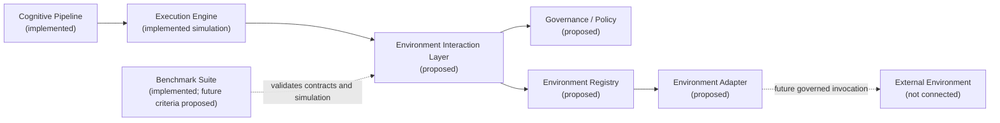
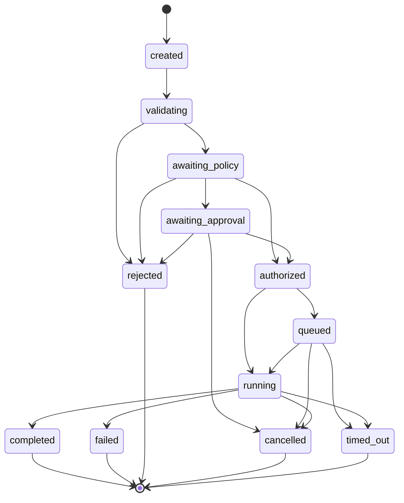
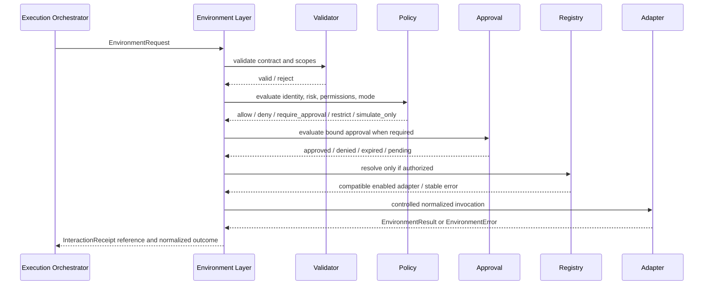

# Environment Interface — historical precursor

> **Status: Superseded.** This proposal was refined after implementation of the
> Operational Resource Foundation. The current Phase B authority is
> [Environment Interaction Layer](environment-interaction-layer.md), recorded
> by [ADR-006](../adr/ADR-006-environment-interaction-layer.md). This file is
> retained for architectural history and must not be used as the current
> implementation specification.

This document defined a future boundary. No environment
> registry, policy engine, approval service, adapter invocation, or external
> integration described here is implemented in the current v0.4.0 runtime.

## 1. Purpose and scope

AEGIS needs one explicit boundary between internal cognition and anything
outside its process and trusted request state. Without that boundary, agents or
execution code could become coupled to providers, bypass authorization, leak
provider-specific failures, and make audit evidence incomplete.

The responsibilities are distinct:

- **Cognition** interprets a mission and identifies required capabilities.
- **Planning** proposes ordered work without performing external actions.
- **Execution orchestration** coordinates authorized work and incorporates
  outcomes into the execution receipt.
- **Governance** decides whether a proposed interaction is allowed, denied,
  restricted, simulated, or requires approval.
- **Environment interaction** validates and normalizes the controlled crossing
  between execution and an external domain.
- **Adapter implementation** contains provider-specific invocation and error
  translation.

The current pipeline and simulated engine remain as documented in
[cognitive-pipeline.md](cognitive-pipeline.md) and
[execution-engine.md](execution-engine.md). This proposal does not change them.

## 2. Definition of an environment

An **environment** is any external system, service, process, resource, person,
or agent with which AEGIS may exchange a request and result. Examples include a
filesystem, HTTP service, Git repository, database, email or calendar service,
message queue, local process, MCP server, human approver, or external agent.

These domains differ operationally, but share governance needs:

- stable identity and capability discovery;
- explicit requested operations and scopes;
- validation, authorization, and optional approval;
- bounded invocation and normalized results;
- stable errors, correlation, and receipts;
- simulation and disabled modes.

A common abstraction standardizes the boundary without pretending every
provider behaves identically. Provider-specific semantics remain inside
adapters and environment-specific policy.

An environment is not the resource itself. The proposed
[Operational Resource Model](operational-resource-model.md) describes the
semantic entity and its stable reference. An environment exposes one or more
access locations for that resource, and an adapter implements the requested
operation. One environment may expose many resources; one logical resource may
have locations in multiple environments.

## 3. Environment is broader than tool

- A **tool** is one actionable interface or operation, such as reading a file
  or creating a calendar event.
- An **adapter** is one implementation that communicates with a provider.
- An **environment** is the external domain being accessed, its capabilities,
  identity, trust boundary, and policy scope.
- The **Environment Interaction Layer** governs how requests cross that
  boundary and how results return.

The kernel and cognitive pipeline must depend on normalized contracts, never on
provider SDKs or concrete adapters. Current AEGIS has no implemented tool
support; this vocabulary is architectural.

## 4. Component boundaries



| Component | Responsibility |
|---|---|
| Cognitive Pipeline | Interpret mission and select internal capability/profile; never select provider credentials or call adapters. |
| Execution Engine | Orchestrate workflow steps and request environment interactions through the controlled boundary. |
| Governance/Policy Layer | Evaluate identity, risk, scope, permissions, mode, budgets, and approvals. |
| Environment Registry | Resolve an authorized environment/capability to a compatible enabled adapter without kernel coupling. |
| Environment Adapter | Implement one provider boundary, declare capabilities/permissions, normalize results/errors, and isolate failures. |
| Environment Interface Layer | Own validation, interception order, registry resolution, controlled invocation, correlation, and interaction receipts. |
| Benchmark Suite | Evaluate deterministic selection, policy, simulation, state order, errors, and receipt completeness. |

The governing principle is:

> Kernel owns cognition. Execution owns orchestration. Governance owns
> authorization. Adapters own external implementation. The environment layer
> owns the controlled boundary.

Neither the cognitive pipeline nor execution engine may invoke a concrete
adapter directly.

## 5. Proposed lifecycle and states



The conceptual flow is:

```text
EnvironmentRequest
  -> Validation
  -> PolicyEvaluation
  -> ApprovalEvaluation
  -> AdapterResolution
  -> Invocation
  -> EnvironmentResult
  -> InteractionReceipt
  -> ExecutionReceipt integration
```

Non-terminal states are `created`, `validating`, `awaiting_policy`,
`awaiting_approval`, `authorized`, `queued`, and `running`. Terminal states are
`completed`, `failed`, `rejected`, `cancelled`, and `timed_out`.

`queued` is optional for synchronous implementations; v0.5 simulation need not
introduce background work. `rejected` is a governance/validation terminal
outcome before invocation. `failed` means an authorized invocation began or a
normalized result was invalid. Terminal states must not transition further.
Every transition must be explicit, ordered, timestamped, and valid for the
preceding state.

## 6. Conceptual contracts

These are documentation contracts, not Python implementations.

### EnvironmentDefinition

- **Responsibility:** stable identity and policy metadata for an external
  domain.
- **Minimum fields:** `environment_id`, display name, environment type,
  supported capability IDs, trust classification, allowed modes, enabled
  state, metadata/schema version.
- **Invariants:** unique stable ID; no embedded secret; disabled definitions
  cannot resolve for invocation.
- **Ownership:** environment configuration/registry administration.
- **Lifecycle relationship:** consulted during validation and resolution.

### EnvironmentCapability

- **Responsibility:** normalized operation that an environment may support.
- **Minimum fields:** `capability_id`, operation class, input/output schema
  versions, required permission set, side-effect classification, simulation
  support.
- **Invariants:** permissions are explicit; side effects are never inferred
  only from free text; schema/version identity is stable.
- **Ownership:** environment interface contract, declared by adapters and
  constrained by policy.
- **Lifecycle relationship:** validated before policy and matched at resolution.

### EnvironmentRequest

- **Responsibility:** immutable proposal to interact with one environment
  capability.
- **Minimum fields:** interaction ID, request ID, execution ID, workflow
  step ID, resolved resource reference/resolution ID where applicable,
  environment selector, capability ID, normalized inputs, requested
  permissions/scopes, execution mode, timeout/budget, metadata/schema version.
- **Invariants:** globally unique interaction ID; complete correlation;
  normalized and schema-valid input; no raw credentials; requested permissions
  cannot grow after policy evaluation.
- **Ownership:** execution orchestration creates it; environment layer owns its
  boundary lifecycle.
- **Lifecycle relationship:** begins at `created`.

### EnvironmentResult

- **Responsibility:** normalized outcome returned from an adapter.
- **Minimum fields:** interaction ID, status, result summary/data reference,
  stable error reference when applicable, provider correlation reference,
  simulation flag, result schema version.
- **Invariants:** identity matches request; status and error are consistent;
  provider-specific objects do not escape; untrusted content remains marked;
  secrets are absent/redacted.
- **Ownership:** adapter produces; environment layer validates.
- **Lifecycle relationship:** accepted during `running` before terminal state.

### EnvironmentError

- **Responsibility:** stable failure representation independent of providers.
- **Minimum fields:** error code/category, safe message, retryability hint,
  source stage, provider-safe reference, details/redaction flags.
- **Invariants:** code belongs to the stable taxonomy; no secret-bearing raw
  exception; retryability does not itself authorize a retry.
- **Ownership:** environment layer taxonomy; adapters translate provider errors.
- **Lifecycle relationship:** explains `failed`, `rejected`, `cancelled`, or
  `timed_out`.

### EnvironmentAdapter

- **Responsibility:** provider-specific implementation behind normalized
  contracts.
- **Minimum surface:** adapter identity/version, environment types,
  capabilities, required permissions, availability/compatibility check,
  normalized invoke/cancel behavior, simulation support.
- **Invariants:** no undeclared capability or permission; stable error
  translation; bounded timeout/cancellation; provider objects do not leak.
- **Ownership:** adapter provider/maintainer.
- **Lifecycle relationship:** resolved only after authorization and invoked
  through the environment layer.

### EnvironmentRegistry

- **Responsibility:** deterministic discovery and resolution of adapters.
- **Minimum fields/operations:** register/disable adapter, list definitions and
  capabilities, resolve by environment/capability/mode/version, availability
  status.
- **Invariants:** unique adapter identity; deterministic tie policy; disabled
  or incompatible adapters never resolve; registration does not grant policy.
- **Ownership:** environment layer composition root.
- **Lifecycle relationship:** used after policy/approval, before invocation.

### PolicyDecision

- **Responsibility:** authoritative outcome for the requested identity, scope,
  capability, and mode.
- **Minimum fields:** decision ID, policy/version, outcome, granted/restricted
  permissions, constraints, reasons/codes, approval requirement, expiry.
- **Invariants:** outcome is one of `allow`, `deny`, `require_approval`,
  `restrict`, or `simulate_only`; grants are a subset of requested permissions;
  default is deny.
- **Ownership:** governance/policy layer.
- **Lifecycle relationship:** controls transition from `awaiting_policy`.

### ApprovalRequirement

- **Responsibility:** represent an approval obligation without coupling to a UI.
- **Minimum fields:** requirement ID, approval mode, requested operation
  summary, approver scope/role, expiry, status, decision identity/evidence.
- **Invariants:** approval binds to exact request/scope/policy version; expired
  or changed requests require reevaluation; approval cannot broaden policy.
- **Ownership:** governance/approval service.
- **Lifecycle relationship:** controls `awaiting_approval`.

### InteractionReceipt

- **Responsibility:** append-only auditable account of the governed interaction.
- **Minimum fields:** all correlation IDs, environment/adapter/capability IDs,
  requested and granted permissions, policy and approval outcomes, ordered
  transitions/timestamps, terminal status, result summary or error code,
  simulation flag, receipt/schema version.
- **Invariants:** one receipt per interaction ID; complete transition order;
  immutable terminal record; data minimization and redaction; no secrets.
- **Ownership:** environment layer creates; audit subsystem may persist later.
- **Lifecycle relationship:** accumulates across all states and is referenced by
  an `ExecutionReceipt`.

## 7. Identity and correlation

Every environment interaction should correlate:

```text
API request_id
  -> execution_id / ExecutionReceipt
  -> workflow step_id
  -> interaction_id / EnvironmentRequest
  -> adapter_invocation_id
  -> InteractionReceipt
  -> BenchmarkResult case_id (when benchmarked)
```

`request_id` preserves the existing API trace. `execution_id` identifies one
execution attempt (a future addition distinct from current request ID).
`step_id` identifies the workflow owner. `interaction_id` uniquely identifies
one governed crossing. `adapter_invocation_id` is internal correlation and must
not substitute for AEGIS identity. Benchmark case IDs belong in benchmark
metadata, not production identity.

This chain supports reconstruction of authorization, adapter choice, failures,
and result integration without logging full payloads.

## 8. Permission model

The proposed normalized permission vocabulary begins with:

- `read`
- `create`
- `modify`
- `delete`
- `execute`
- `network`
- `secret_access`
- `privileged`
- `human_approval`

Permissions require environment-specific scopes: `read` alone is insufficient
without what may be read. A request declares needed permissions/scopes, an
adapter declares the maximum it may require, and policy grants an equal or
narrower set. Invocation uses the intersection; no layer may silently add a
permission.

Principles:

- default deny;
- least privilege per request and environment;
- separate read from mutation and execution;
- explicit network, secret, and privileged access;
- read-only mode rejects `create`, `modify`, `delete`, and `execute`;
- human approval is an obligation, not a substitute for policy permission;
- adapter registration or availability never implies authorization.

No such permission engine exists in v0.4.0.

## 9. Policy and governance interception



The pipeline and execution engine must never call an adapter directly.
Validation, policy, approval, resolution, and controlled invocation are
mandatory interception points. `restrict` reduces scope/permissions;
`simulate_only` resolves only simulation-capable adapters; neither permits a
real invocation.

## 10. Approval model

Future approval modes may include:

- no approval required under explicit policy;
- pre-approved policy scope;
- one-time human approval bound to one request;
- per-operation approval;
- denied;
- expired approval.

Approval is represented as a versioned requirement and decision record, not a
specific UI. Pending approval keeps the interaction non-terminal at
`awaiting_approval`. Denial or expiry produces a stable terminal outcome or a
new policy/approval cycle; it must never fall through to invocation.

## 11. Registry and adapter discovery

The registry should support:

- adapter registration and explicit disablement;
- stable environment and adapter identifiers;
- provider selection under policy constraints;
- capability discovery;
- health/availability checks;
- contract and version compatibility;
- deterministic simulation adapters;
- disabled/unavailable adapter reporting.

Resolution inputs include environment ID/type, capability, requested mode,
required contract version, and policy restrictions. Tie-breaking must be
deterministic and auditable. The kernel imports interface contracts only; a
composition root registers concrete adapters.

## 12. Adapter contract and failure isolation

Adapters must declare capabilities and required permissions, accept normalized
requests, return normalized results, translate provider failures into stable
environment errors, and prevent provider-specific behavior from leaking into
the kernel.

Invocation boundaries must isolate timeouts, cancellation, invalid results, and
provider exceptions. Simulation/mock modes should use the same normalized
contracts and receipt flow. An adapter must not perform undeclared retries,
permission escalation, secret retrieval, network access, or side effects.

## 13. Results and receipts

`EnvironmentResult` is the normalized operational outcome. It may carry safe
structured data or a reference, but it is not the audit history.

`InteractionReceipt` is the auditable lifecycle record: identities, timestamps,
environment and adapter selection, capability, requested/granted permissions,
policy and approval outcomes, transitions, result summary, stable failure code,
and simulation flag.

`ExecutionReceipt` remains the higher-level workflow record and may reference
one or more interaction receipts per step. It should not embed unlimited
provider payloads.

Receipts must not store credentials, tokens, secret values, raw sensitive
payloads, or unnecessary external content. Redacted summaries and integrity-
checked references are preferable.

## 14. Stable error taxonomy

Initial conceptual categories:

- `invalid_request`
- `permission_denied`
- `policy_rejected`
- `approval_required`
- `approval_expired`
- `environment_unavailable`
- `adapter_not_found`
- `unsupported_capability`
- `timeout`
- `cancelled`
- `provider_error`
- `invalid_result`
- `internal_error`

Stable categories let execution decide consistent failure semantics, governance
audit denials, benchmarks assert behavior, and operators diagnose failures
without depending on provider exception strings. Provider detail may be
retained behind a safe reference but must not become the public contract.

## 15. Simulation-first design

The first implementation should use deterministic simulation adapters only.
They must:

- perform no external action;
- traverse validation, policy, approval, resolution, invocation, and receipt
  stages;
- produce deterministic normalized results;
- generate complete interaction receipts;
- support explicit controlled failures/timeouts/cancellation;
- remain testable and benchmarkable;
- refuse any mode that implies real network, filesystem, process, or provider
  access.

Simulation must be an explicit mode and receipt field, not a provider naming
convention.

## 16. Benchmark implications

Future benchmark expectations may evaluate:

- environment selection;
- requested capability;
- requested and granted permissions;
- policy outcome;
- approval requirement/outcome;
- adapter resolution;
- simulation status;
- terminal result status;
- stable error code;
- receipt field completeness;
- valid state-transition order and correlation.

These extensions should remain deterministic and optional. This architecture
task adds no cases or scoring fields.

## 17. Future testing strategy

Required implementation tests should cover:

- valid deterministic mock interaction;
- unknown environment and missing/disabled adapter;
- unsupported capability;
- permission denial and read-only restrictions;
- policy rejection, restriction, and simulation-only decisions;
- approval required, denied, and expired;
- timeout and cancellation;
- adapter failure and malformed normalized result;
- deterministic receipt generation and transition order;
- request/execution/step/interaction correlation;
- simulation-only enforcement;
- direct adapter bypass prevention.

Integration tests must prove that execution cannot obtain or invoke an adapter
except through the environment layer.

## 18. Security and privacy

### Current controls

v0.4.0 performs no external interaction. It validates execution requests,
records deterministic simulated transitions, and marks receipts simulated.
There is no policy engine, secret system, adapter sandbox, or external-content
processing boundary.

### Future requirements

- default-deny policy and least privilege;
- secret isolation and reference-only credential handling;
- input/output data minimization and receipt redaction;
- attributable audit events;
- provider-specific trust boundaries;
- validation and containment of untrusted output;
- explicit defenses against prompt injection in external content;
- adapter sandboxing and resource limits;
- network and filesystem isolation;
- controlled serialization to prevent object/provider leakage.

External content must be treated as untrusted data, never as authority to change
policy, permissions, system instructions, or adapter scope.

## 19. Proposed v0.5.0 scope

v0.5.0 is proposed as **Environment Interaction Layer — Simulation First**.

Minimum future implementation:

- Phase A provider-neutral resource contracts, synthetic in-memory catalog,
  requirements, and deterministic resolution;
- environment contracts;
- deterministic registry;
- policy-decision interface;
- deterministic simulation adapter;
- normalized results/errors;
- interaction receipts and execution-receipt references;
- focused tests, benchmark extensions, and documentation.

Explicit exclusions:

- real internet or HTTP access;
- real filesystem access or writes;
- shell/local-process execution;
- email, calendar, Git provider, database, MCP, or plugin integration;
- background execution or autonomous actions;
- persistent memory, reflection, secret storage, or production sandboxing.

## 20. Phased roadmap

These are cautious planning proposals, not commitments:

1. **Contracts and deterministic simulation:** prove lifecycle, policy
   interception, registry resolution, errors, and receipts with no external
   action.
2. **Read-only local environment under explicit policy:** only after isolation,
   path scoping, denial tests, and security review.
3. **Read-only HTTP interaction:** only after network allowlists, untrusted-
   content controls, timeouts, size limits, and secret isolation.
4. **Governed Git interaction:** bounded repositories and operations with
   explicit mutation approvals.
5. **Calendar and email integrations:** identity, privacy, recipient/resource
   confirmation, and per-operation approvals.
6. **Provider and plugin ecosystem:** versioned contracts, trust review,
   disablement, distribution, and compatibility governance.

No later phase is authorized merely because the abstraction exists.

## Related documents

- [Governance status](governance.md)
- [Operational Resource Model](operational-resource-model.md)
- [Execution engine](execution-engine.md)
- [Benchmark suite](benchmark-suite.md)
- [ADR-004](../adr/ADR-004-environment-interface.md)
- [ADR-005](../adr/ADR-005-operational-resource-model.md)
- [Proposed roadmap](../roadmap/ROADMAP.md)
