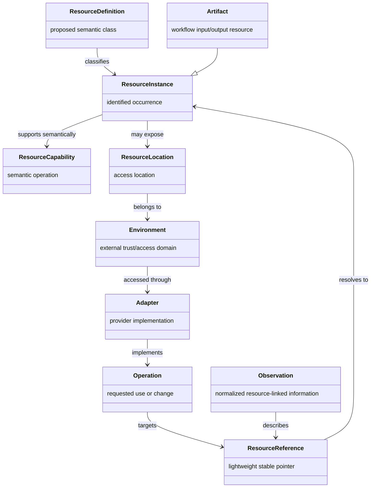
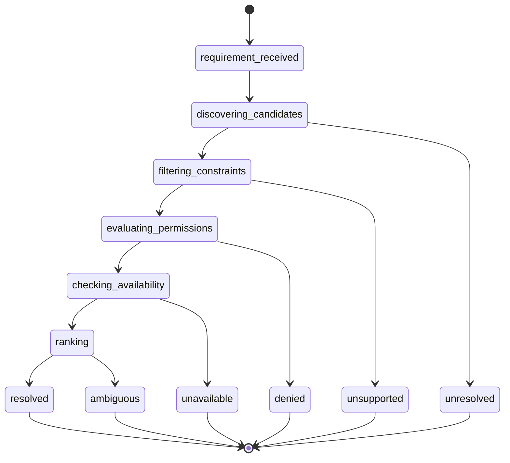
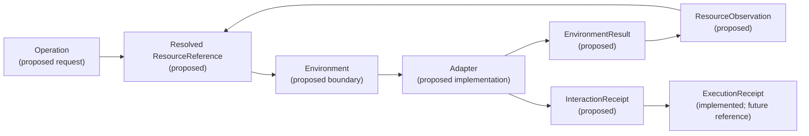

# Operational Resource Model — proposed architecture

> **Status: Proposed.** This document defines a provider-neutral semantic model.
> No resource catalog, discovery, resolution, persistence, mutation, or external
> interaction described here exists in the current runtime.

## 1. Operational resource

An **Operational Resource** is AEGIS's normalized internal representation of
something a mission may need to inspect, use, modify, invoke, query, observe,
coordinate with, or reason about.

Potential resources include repositories, files, folders, documents, datasets,
benchmark suites and reports, knowledge bases, memory stores, APIs, databases,
calendars, inboxes, queues, services, computational models, local processes,
devices, humans, experts, agents, organizations, projects, workflow artifacts,
credential references, policy objects, and logical or virtual entities.

This definition does not imply that AEGIS currently discovers or interacts with
any of them. It supplies the semantic target required before an environment or
adapter is selected.

## 2. Core concepts



| Concept | Meaning |
|---|---|
| Resource | The thing that exists or is required. |
| Resource Reference | A stable lightweight pointer used by missions, workflows, requests, observations, and receipts. |
| Resource Type | The semantic category of a resource. |
| Resource Instance | One identified resource, such as a particular repository. |
| Resource Capability | An operation semantically supported by or applicable to the resource. |
| Environment | The external domain or governed boundary containing or exposing a resource. |
| Adapter | The provider-specific implementation used through an environment. |
| Action/Operation | A requested query, observation, invocation, or change. |
| Permission | Authority required for the operation and scope. |
| Artifact | A resource produced or consumed by a workflow. |
| Observation | Normalized information obtained about or from a resource. |

Example: “the AEGIS repository” is a resource instance of type `repository`.
`inspect` and `read_history` are semantic capabilities. A provider-neutral
reference identifies it. A Git environment exposes one location. A specific
adapter could operationally support `read_history`. The operation needs
`inspect`/`read`, and its result may produce a normalized observation and an
interaction receipt.

## 3. Resource-first reasoning


The intended reasoning sequence is:

```text
Mission
  -> Objective
  -> Required Resources
  -> Resource Resolution
  -> Capability Selection
  -> Interaction Planning
  -> Policy Evaluation
  -> Environment Request
  -> Adapter Invocation
  -> Observation or Result
  -> Receipt
```

AEGIS should express: “I require resource X with capability Y under permission
Z.” It should not express only: “Call tool T.”

Resource-first reasoning preserves intent when providers, locations, or
adapters change; exposes missing/ambiguous prerequisites before execution;
allows policy to evaluate the target and operation; and makes simulation,
receipts, and benchmarks provider-neutral. Direct tool selection collapses
semantic need, provider choice, permission, and invocation into one unsafe
decision.

## 4. Architectural role

The Operational Resource Model is a shared semantic contract, not a second
execution engine and not a provider registry.

| Layer | Relationship to resources |
|---|---|
| Cognitive Pipeline | May infer `ResourceRequirement` values from mission intent; currently does not. |
| Workflow Generation | May attach lightweight resource requirements/references to steps. |
| Execution Engine | Coordinates resolved references and operations; never discovers providers itself. |
| Governance | Authorizes resolution, access, capability use, observation, retention, sharing, and mutation. |
| Environment Interaction Layer | Accepts resolved resource targets and governs the external crossing. |
| Environment Registry | Resolves compatible adapters/environments, not semantic resource identity. |
| Adapters | Implement operations for supported resource types/capabilities. |
| Memory | May later retain resource-linked experiences; it is not the resource catalog. |
| Knowledge | May later contain verified claims about resources; it is not the operational instance. |
| Benchmark Suite | May evaluate inference, resolution, permissions, correlations, and provenance. |

## 5. Proposed contracts

These contracts are conceptual documentation only.

### ResourceDefinition

- **Purpose:** describe a reusable semantic resource class.
- **Minimum fields:** definition ID/version, type ID, display name, applicable
  capabilities, default constraints, classification/provenance requirements.
- **Invariants:** provider-neutral; versioned; no instance locator or secret.
- **Ownership:** resource-model maintainers.
- **Lifecycle role:** validates descriptors and requirements.
- **Describes:** class.

### ResourceReference

- **Purpose:** lightweight pointer to a logical resource or requirement-bound
  resolution.
- **Minimum fields:** resource ID, namespace, optional version/revision selector,
  optional resolution ID, reference schema version.
- **Invariants:** no full payload, credential, mutable provider session, or
  ambiguous raw path; identity and selector semantics are explicit.
- **Ownership:** workflows/requests/receipts carry it; catalog resolves it.
- **Lifecycle role:** crosses component boundaries and correlates records.
- **Describes:** reference.

### ResourceIdentity

- **Purpose:** provider-neutral identity for one logical instance.
- **Minimum fields:** resource ID, namespace, type, owner/authority references,
  lifecycle status, identity schema version.
- **Invariants:** stable across location/provider changes; globally unique
  within namespace; never derived only from a mutable display name.
- **Ownership:** resource authority/catalog.
- **Lifecycle role:** anchors definitions, locations, observations, relations,
  and receipts.
- **Describes:** instance identity.

### ResourceType

- **Purpose:** extensible semantic category.
- **Minimum fields:** type ID, parent category, version, description, applicable
  capability IDs, validation constraints.
- **Invariants:** stable identifier; additions do not require kernel code;
  inheritance cannot silently broaden permission.
- **Ownership:** type registry/resource-model governance.
- **Lifecycle role:** requirement matching and descriptor validation.
- **Describes:** class taxonomy.

### ResourceLocation

- **Purpose:** provider-neutral access location for a logical resource.
- **Minimum fields:** location ID, resource ID, environment ID, provider/locator
  data, region/scope, local/remote and logical/physical flags, availability,
  version/revision selector.
- **Invariants:** no embedded secret; locator is treated as sensitive when
  necessary; location change does not change resource identity.
- **Ownership:** resource catalog and environment configuration.
- **Lifecycle role:** candidate resolution and environment targeting.
- **Describes:** instance location.

### ResourceCapability

- **Purpose:** semantic operation applicable to a resource type/instance.
- **Minimum fields:** capability ID/version, operation class, input/output
  semantics, required permissions, side-effect class, constraints.
- **Invariants:** provider-neutral; permission requirements explicit;
  capability existence does not establish adapter support or authorization.
- **Ownership:** resource model; adapters declare operational support.
- **Lifecycle role:** requirement matching and interaction planning.
- **Describes:** class/instance capability.

### ResourcePermission

- **Purpose:** requested or granted authority over a resource/capability/scope.
- **Minimum fields:** permission ID, operation, resource reference/scope,
  constraints, grant source, expiry/mode.
- **Invariants:** default deny; grants cannot exceed request/policy; no secret
  value; resource and environment scopes remain explicit.
- **Ownership:** governance.
- **Lifecycle role:** resolution filtering and interaction authorization.
- **Describes:** requirement or grant.

### ResourceConstraint

- **Purpose:** machine-evaluable limitation on acceptable resources or use.
- **Minimum fields:** constraint ID/type, operator, value/reference, severity,
  source, validation version.
- **Invariants:** deterministic interpretation for v0.5; unknown mandatory
  constraints fail closed; policy constraints cannot be discarded.
- **Ownership:** mission/workflow, policy, or resource authority.
- **Lifecycle role:** candidate filtering and operation validation.
- **Describes:** requirement/instance restriction.

### ResourceState

- **Purpose:** current declared or observed resource condition.
- **Minimum fields:** resource reference, common status, type-specific status,
  observed/valid times, version/revision, verification source.
- **Invariants:** state is time-bound and provenance-bearing; absence is not
  “available”; state does not equal interaction-request status.
- **Ownership:** resource authority or validated observation pipeline.
- **Lifecycle role:** availability/freshness filtering.
- **Describes:** instance state.

### ResourceDescriptor

- **Purpose:** normalized summary of one resource instance.
- **Minimum fields:** identity, type, names/labels, owners/authorities,
  locations, capabilities, classification, state, provenance, relations.
- **Invariants:** normalized and versioned; secrets excluded; claimed versus
  verified fields distinguishable.
- **Ownership:** catalog aggregates; authorities supply facts.
- **Lifecycle role:** candidate discovery and resolution input.
- **Describes:** instance.

### ResourceRequirement

- **Purpose:** express what a mission/workflow needs before selecting an
  instance.
- **Minimum fields:** requirement ID, type/type constraints, capabilities,
  permissions, constraints, preferred environment, freshness/version/trust,
  ownership constraints, cardinality, required/optional flag.
- **Invariants:** provider-neutral; no adapter selection; required versus
  preferred constraints explicit; stable correlation to objective/step.
- **Ownership:** cognition/planning proposes; governance may restrict.
- **Lifecycle role:** starts resource resolution.
- **Describes:** requirement.

### ResourceResolution

- **Purpose:** auditable result of resolving a requirement.
- **Minimum fields:** resolution ID, requirement ID, status, selected references,
  considered candidate references/count, deterministic rank evidence,
  rejected-reason codes, policy decision references, timestamp/version.
- **Invariants:** status and selections consistent; denied candidates not
  selectable; ambiguity is explicit; deterministic tie behavior recorded.
- **Ownership:** future resource resolver.
- **Lifecycle role:** bridges requirements to workflow/environment targeting.
- **Describes:** resolution outcome.

### ResourceObservation

- **Purpose:** normalized resource-linked information obtained through a
  governed interaction or trusted internal source.
- **Minimum fields:** observation ID, resource reference, interaction/result
  references, observation type/value or safe data reference, observed time,
  provenance, confidence/verification, classification/redaction.
- **Invariants:** source and resource correlation required; raw untrusted output
  not promoted automatically; secrets excluded; observation is immutable.
- **Ownership:** normalization layer; memory/knowledge may consume later.
- **Lifecycle role:** validated output after `EnvironmentResult`.
- **Describes:** observation.

### ResourceRelation

- **Purpose:** typed, directional connection between resource references.
- **Minimum fields:** relation ID/type, source and target references, provenance,
  validity interval, confidence/verification, metadata version.
- **Invariants:** valid references and relation type; direction explicit;
  relation is not automatic authorization or transitive trust.
- **Ownership:** resource catalog/observation normalization.
- **Lifecycle role:** supplies bounded context and lineage.
- **Describes:** relationship.

## 6. Resource identity

A resource identity may include:

- stable `resource_id`;
- human-readable name;
- `resource_type`;
- namespace;
- owner and managing/access authority references;
- provider-neutral identity;
- one or more provider-specific locators stored separately;
- version/revision selectors;
- content hash where meaningful;
- lifecycle status.

Identity answers **what logical thing this is**. Location answers **where and
through which environment it may be accessed**. A repository may retain one
identity when moved between hosting providers. A document may retain identity
across storage paths while revisions and hashes change. Conversely, one URI
reused for different content does not prove stable identity.

Content hashes identify immutable content snapshots, not every logical resource.
Version and revision are selectors/state metadata and must not be conflated with
the stable resource ID.

## 7. Resource references

`ResourceReference` is intentionally small enough for missions, workflow steps,
environment requests, receipts, benchmark expectations, memory records, and
observations. It points to identity and optionally constrains version/revision
or records the resolution that selected it.

Resolution behavior:

1. validate reference syntax/namespace;
2. locate identity under the requesting authority/tenant;
3. apply selector and lifecycle constraints;
4. check visibility and policy before returning a descriptor;
5. return a stable outcome.

Failure outcomes should distinguish `invalid_reference`, `not_found`,
`version_not_found`, `restricted`, `deleted`, `stale`, and
`ambiguous_reference`. References must not embed full resource data, raw
credentials, provider sessions, or unbounded locations.

## 8. Extensible type taxonomy

Suggested top-level categories:

- `information`
- `artifact`
- `collection`
- `computational`
- `service`
- `communication`
- `human`
- `agent`
- `organizational`
- `physical`
- `logical`
- `governance`
- `credential_reference`

These are broad classification roots, not a rigid ontology. Specific type
definitions should be data/configuration registered through a versioned type
registry. The kernel consumes type/capability identifiers and generic
invariants; adding `repository`, `calendar`, or a future provider-neutral type
must not require modifying kernel control flow.

Type inheritance may supply semantic defaults, but cannot automatically inherit
authorization or adapter support.

## 9. Resource capabilities

Capabilities belong semantically to resource definitions/instances. Adapters
separately declare which of those capabilities they can operationally support.

Examples:

- **Repository:** `inspect`, `search`, `read_history`, `create_branch`,
  `commit`, `compare_versions`.
- **Document:** `read`, `summarize`, `transform`, `annotate`, `version`.
- **Calendar:** `inspect_availability`, `create_event`, `modify_event`,
  `cancel_event`.
- **Human:** `request_input`, `request_approval`, `request_review`.

Availability is the intersection of:

```text
resource semantic capability
AND adapter support
AND requested/granted permissions
AND policy outcome
AND resource state/constraints
AND environment availability
AND execution mode (simulation or real)
```

Capability declaration never implies permission or availability.

## 10. Resource location

`ResourceLocation` separates provider access details from logical identity. It
may describe environment ID, provider, locator, region/scope, local/remote,
logical/physical, availability, and version/revision selector.

Locations contain references to credentials, never secret values. Locators may
also be sensitive and should be minimized/redacted in receipts.

One resource may expose several locations: a canonical repository and mirror,
an immutable report in object storage and a local cache, or a human reachable
through multiple communication environments. Resolution chooses a location
under policy; it does not create a new resource identity unless semantics
require it.

## 11. Ownership and authority

The model distinguishes:

- **resource owner:** party with ownership interest;
- **managing authority:** party/system maintaining identity/state;
- **access authority:** policy source allowed to grant access;
- **policy domain:** rules governing use and retention;
- **tenant/workspace:** isolation boundary;
- user-controlled, system-controlled, shared, public, and external resources.

Ownership does not automatically grant technical access, and an access
authority does not necessarily own the resource. A user may own a document
managed by an organization, with access governed by a workspace administrator
and provider policy. Every resolution and operation must preserve these
distinctions.

## 12. Permissions

Proposed resource permissions include:

- `discover`
- `inspect`
- `read`
- `create`
- `modify`
- `delete`
- `execute`
- `invoke`
- `share`
- `administer`
- `approve`
- `delegate`
- `network`
- `secret_access`

They refine and map to the Environment Interaction Layer vocabulary. Resource
permissions express semantic authority over a target; environment permissions
also govern the crossing (for example, `network`). An operation requires both.

The model is default-deny and least-privilege. Grants are scoped by resource,
capability, tenant/workspace, location/environment, time, and constraints.
Explicit grants should override inherited ambiguity only by narrowing, never by
silent expansion. Read-only resources reject mutation/execute capabilities.
Immutable resources may allow read/inspect while prohibiting every state
change.

This is proposed architecture, not an implemented permission engine.

## 13. Resource state

Common cross-type states may include:

- `declared`
- `unresolved`
- `resolving`
- `available`
- `unavailable`
- `restricted`
- `stale`
- `archived`
- `deleted`
- `invalid`

Only identity existence, validity, and a bounded availability view are broadly
common. Domain states should remain type-specific: a human may be unavailable,
a document stale, a process stopped, or a policy superseded. The common model
must not force all resources through one identical state machine.

Resource state describes the resource. It is separate from resource-resolution
status and from environment-interaction states such as `awaiting_policy` or
`running`.

## 14. Resource requirements

`ResourceRequirement` states what is needed before a concrete instance is
selected. Examples:

- a readable benchmark dataset;
- the current project repository;
- an approved human reviewer;
- a writable report destination;
- a calendar owned by the requesting user;
- a model supporting structured output.

A requirement may specify type, capabilities, permissions, hard/preferred
constraints, preferred environment, freshness, version, trust, ownership,
cardinality, and required/optional status. It remains provider-neutral and
correlates to a mission objective and workflow step.

Optional requirements may resolve empty without failing the mission. Required
unresolved, ambiguous, denied, unavailable, or unsupported requirements must be
explicit before execution.

## 15. Resource resolution



Conceptual resolution:

```text
ResourceRequirement
  -> candidate discovery
  -> constraint filtering
  -> permission evaluation
  -> availability check
  -> deterministic ranking
  -> ResourceResolution
```

Outcomes are `resolved`, `unresolved`, `ambiguous`, `denied`, `unavailable`, or
`unsupported`. Deterministic v0.5 resolution should use declared exact fields,
stable ordering, and recorded reasons. Adaptive ranking may be considered only
after deterministic behavior, evidence, governance, and benchmarks exist; it
must never bypass hard constraints or policy.

This milestone implements neither discovery nor ranking.

## 16. Resource relations

Useful relation types include:

- `contains`
- `belongs_to`
- `derived_from`
- `version_of`
- `produced_by`
- `consumed_by`
- `governed_by`
- `owned_by`
- `accessible_through`
- `depends_on`
- `supersedes`
- `references`
- `related_to`

Relations supply bounded context and provenance without requiring a full
knowledge graph. They are typed records between references, not executable
edges, transitive permissions, or proof of trust. Traversal depth and allowed
relation types should be explicit.

## 17. Artifacts and observations

An **Artifact** is a resource consumed or produced by a workflow. A benchmark
report, generated document, or proposed patch may be an artifact.

An **EnvironmentResult** is the immediate normalized adapter outcome.
An **InteractionReceipt** records the governed interaction lifecycle.
A **ResourceObservation** is validated resource-linked information derived from
the result and suitable for later reasoning, memory, or knowledge evaluation.



Raw provider output must not flow directly into cognition. It must be bounded,
validated, classified as untrusted where appropriate, normalized, correlated,
and redacted before becoming an observation.

## 18. Trust and provenance

Proposed provenance metadata includes:

- source resource and environment;
- provider and adapter identity/version;
- creation and observation times;
- resource version/revision;
- author/owner/authority references;
- content hash when meaningful;
- confidence;
- verification status and verifier;
- lineage and `derived_from` relations.

Metadata is itself a claim. Provider names, timestamps, authorship, confidence,
and lineage must retain their source and verification status rather than being
treated as inherently trustworthy. Cryptographic hashes prove byte identity,
not truth or safety.

## 19. Security and privacy

The model should support:

- resource classification and sensitive-data labels;
- indirect credential/secret references only;
- data minimization and redaction;
- owner/authority and tenant isolation;
- explicit treatment of public, shared, external, and untrusted resources;
- prompt-injection and malicious-content flags;
- malformed-resource rejection;
- immutable receipt/observation references;
- retention, deletion, revocation, and legal-policy metadata.

Credentials and secret values must never be embedded in definitions,
descriptors, locations, references, observations, or receipts. A
`credential_reference` is an opaque governed pointer, not a credential store.
Deleted or revoked resources must remain safely referential for audit without
remaining accessible.

## 20. Memory and knowledge boundaries

Resources are not memory.

- A document is an operational resource.
- A stored experience is an episodic memory record.
- A verified fact may belong to semantic knowledge.
- An observation is a resource-linked claim that may later be evaluated for
  memory/knowledge promotion.
- Working context is transient selected information for one run.
- An artifact is a workflow input/output resource.
- A receipt is audit evidence about an interaction, not semantic knowledge.

Operational resource descriptors answer what exists and how it may be accessed.
Memory records answer what prior runs retained. Knowledge answers what claims
have been validated under a knowledge policy. No observation should be promoted
automatically, and this architecture changes none of the current memory or
knowledge prototypes.

## 21. Governance relationship

Governance intercepts:

- resource discovery and resolution visibility;
- access to descriptors and locations;
- capability selection;
- environment operation invocation;
- observation recording and classification;
- result retention;
- resource sharing/delegation;
- modification, deletion, and administration.

The cognitive pipeline may propose requirements but cannot select hidden
resources, grant permissions, resolve adapters, or invoke environments.
Execution may orchestrate resolved references but cannot bypass resource,
policy, approval, or environment boundaries.

## 22. Environment Interface relationship

The resource model supplies the semantic target. The environment supplies the
external access/trust boundary. The adapter implements an operation. The
Environment Interaction Layer validates authorization and controls invocation.

Where an operation targets a resource, a future `EnvironmentRequest` should
carry a resolved `ResourceReference` and `ResourceResolution` reference rather
than a raw provider path/URI. Environments expose one or more resource
locations; adapter resolution occurs only after semantic resource and
permission resolution.

Resources may also be internal/logical and require no external invocation.
Environment definitions are therefore not substitutes for resources, and the
resource model must not absorb adapter/provider registration.

See [environment-interface.md](environment-interface.md) and
[ADR-004](../adr/ADR-004-environment-interface.md).

## 23. Benchmark implications

Future optional benchmark criteria may evaluate:

- required-resource inference;
- resource-type selection;
- resource-resolution outcome;
- capability matching;
- permission requirements;
- hard/preferred constraint satisfaction;
- deterministic candidate selection;
- ambiguous/unavailable/unresolved handling;
- resource-reference correlation;
- provenance completeness.

Benchmark data should use synthetic deterministic descriptors and simulation
only. This architecture task adds no cases, models, or scoring behavior.

## 24. Testing implications

Future tests should cover:

- valid definitions/descriptors and invalid identities;
- reference resolution and version selectors;
- extensible type registration without kernel modification;
- resource/adapter capability compatibility;
- permission mismatch and read-only/immutable enforcement;
- unavailable, ambiguous, unresolved, stale, archived, and deleted resources;
- ownership/authority and tenant mismatch;
- relation validation without permission inheritance;
- observation/receipt/resource correlation;
- provenance preservation and untrusted metadata;
- secret exclusion and redaction;
- deterministic resolution/tie behavior;
- kernel and cognition decoupling from providers/adapters.

## 25. Proposed phased implementation

These are proposals, not commitments:

1. **Typed contracts and in-memory deterministic catalog:** definitions,
   references, descriptors, types, relations, validation; no discovery.
2. **Requirements and deterministic resolution:** exact synthetic candidates,
   constraints, outcomes, and reasons.
3. **Workflow resource references:** attach requirements/references without
   changing execution side effects.
4. **Environment targeting and receipt correlation:** pass resolved references
   through simulation-only environment requests.
5. **Observation normalization and provenance:** validate synthetic results
   into immutable resource observations.
6. **Persistent catalog and policy-aware discovery:** only after storage,
   tenancy, privacy, migration, and revocation design.
7. **Memory and knowledge integration:** only after promotion/provenance policy
   and cross-run governance exist.

## 26. Current scope boundaries

This milestone implements:

- no resource catalog runtime;
- no filesystem scanning or mutation;
- no network/service discovery;
- no provider integration;
- no persistent resource database;
- no knowledge graph or semantic search;
- no adaptive ranking;
- no memory integration;
- no autonomous resource acquisition;
- no credential storage;
- no background synchronization;
- no external action.

It creates documentation only.

## 27. Roadmap treatment

The Operational Resource Model is proposed as **v0.5 Phase A**, a prerequisite
to **Phase B: Environment Interaction Layer — Simulation First**. This is more
coherent than a new public version because environment requests need semantic
targets, while both phases share the v0.5 objective of proving a governed
provider-neutral boundary without external action.

Phase A should end with contracts, deterministic in-memory synthetic catalog,
requirements/resolution, tests, and benchmark extensions. Phase B should add
simulation-only environment contracts, registry/policy interception, normalized
results/errors, and receipts targeting Phase A references.

## Related documents

- [Environment Interaction Layer](environment-interface.md)
- [Governance status](governance.md)
- [Memory status](memory-system.md)
- [Benchmark architecture](benchmark-suite.md)
- [ADR-005](../adr/ADR-005-operational-resource-model.md)
- [Roadmap](../roadmap/ROADMAP.md)
